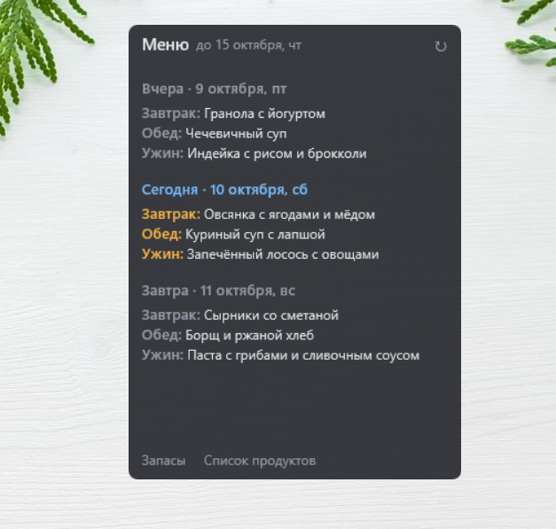

# Виджет меню на рабочий стол


Виджет для Windows, который показывает меню на **вчера, сегодня и завтра** из Google Таблицы.
Данные загружает Python-скрипт, отображает [Rainmeter](https://www.rainmeter.net/),
обновление — по расписанию через Планировщик заданий Windows.

```
Google Таблица ──► Python (fetch → transform → export) ──► data.inc ──► Rainmeter
                         ▲
        Планировщик: каждый день в 00:05 и при входе в Windows; кнопка ↻ на виджете
```

## Возможности

- Три дня: вчера / сегодня / завтра — с датой, приёмами пищи и блюдами.
- При загрузке виджет сразу прокручен к «Сегодня»; колёсико мыши — прокрутка, при наведении видна полоса прокрутки.
- Приёмы пищи сегодняшнего дня выделены цветом.
- Клик по «Меню» открывает лист меню, кнопки «Запасы» и «Список продуктов» — соответствующие листы.
- Кнопка ↻ — обновить данные сейчас (в подсказке — время последнего обновления).
- Если нет интернета — до 3 попыток с паузой; при ошибке виджет показывает последние удачные данные.

## Структура проекта

| Файл | Назначение |
|---|---|
| `main.py` | точка входа: загрузка → обработка → запись → обновление скина, лог |
| `fetch.py` | загрузка листа «Меню» (даты — числом, с годом) и ссылок на листы |
| `transform.py` | протягивание объединённых дат, очистка пробелов, выбор трёх дней |
| `export.py` | запись `data.inc` (UTF-16) и команда Rainmeter на обновление |
| `config.py` | пути и права доступа (только чтение таблиц) |
| `check_access.py` | проверка доступа к таблице — выводит только структуру, без данных |
| `demo.py` | вымышленные данные для демо-режима |
| `settings.example.json` | шаблон настроек |
| `rainmeter/MenuWidget/MenuWidget.ini` | скин Rainmeter |

Не хранятся в git (см. `.gitignore`): `credentials.json` (ключ), `settings.json` (ID таблицы),
`rainmeter/MenuWidget/@Resources/data.inc` (данные), `logs/`, `.venv/`.

## Ожидаемая структура листа «Меню»

| Дата | Время приема пищи | Меню |
|---|---|---|
| 05.10.2026 *(объединённая ячейка на 3 строки)* | Завтрак | … |
| | Обед | … |
| | Ужин | … |

Первая строка — заголовки. Дата должна быть **датой** (не текстом) — формат отображения любой.

## Установка с нуля

### 1. Python-окружение
```
python -m venv .venv
.venv\Scripts\pip install -r requirements.txt
```

### 2. Доступ к Google Таблице (сервисный аккаунт)
1. [Google Cloud Console](https://console.cloud.google.com) → создать проект.
2. APIs & Services → Library → включить **Google Sheets API**.
3. IAM & Admin → Service Accounts → создать аккаунт **без ролей**.
4. У аккаунта: Keys → Add key → JSON → сохранить в папку проекта как `credentials.json`.
5. В таблице: «Настройки доступа» → добавить email сервисного аккаунта с ролью **Читатель**.
   Общий доступ таблицы — «Доступ ограничен».

### 3. Настройки
Скопировать `settings.example.json` → `settings.json` и заполнить:
- `spreadsheet_id` — часть адреса таблицы между `/d/` и `/edit`;
- `menu_sheet` — название листа с меню;
- `link_sheets` — листы для кнопок виджета.

Проверка: `python check_access.py` — все строки должны начинаться с ✓.

### 4. Rainmeter
1. Установить Rainmeter.
2. Сделать ссылку на папку скина (PowerShell, путь — свой):
   ```
   New-Item -ItemType Junction -Path "$env:USERPROFILE\Documents\Rainmeter\Skins\MenuWidget" -Target "<папка проекта>\rainmeter\MenuWidget"
   ```
3. Запустить `python main.py --no-refresh` — появится `data.inc`.
4. Rainmeter → Manage → Refresh all → `MenuWidget` → `MenuWidget.ini` → Load.

### 5. Планировщик заданий
Создать задачу (Create Task, не Basic):
- **General:** Run only when user is logged on.
- **Triggers:** Daily в 00:05; At log on с задержкой 1 минута.
- **Actions:** Program `<папка проекта>\.venv\Scripts\pythonw.exe`, Arguments `main.py`,
  **Start in** `<папка проекта>`.
- **Conditions:** снять «Start the task only if the computer is on AC power».
- **Settings:** Run task as soon as possible after a scheduled start is missed;
  Stop the task if it runs longer than 1 hour; **не** отмечать «delete it after».

## Запуск вручную

```
python main.py               # обновить данные и виджет
python main.py --no-refresh  # только записать data.inc, не трогая Rainmeter
python main.py --demo        # вымышленные меню — для скриншотов
```

### Демо-режим (для скриншотов)

`python main.py --demo` записывает в виджет вымышленные меню (`demo.py`) и обновляет скин —
настоящие данные из Google при этом не загружаются. Сделайте скриншот, затем верните
свои данные: `python main.py` или кнопка ↻ на виджете (а также следующий запуск по расписанию).

## Настройка внешнего вида

В `MenuWidget.ini`, секция `[Variables]`: `W` — ширина, `ViewH` — высота области меню,
`Color…` — цвета (`R,G,B,прозрачность`). После правки: ПКМ по виджету → Refresh skin.
Файл скина хранится в **UTF-16** — иначе Rainmeter не покажет кириллицу.

## Если что-то не работает

| Симптом | Где смотреть / причина |
|---|---|
| Данные не обновляются | `logs/widget.log`; в Планировщике — Last Run Result должен быть `0x0` |
| «Кракозябры» вместо кириллицы | `.ini` или `data.inc` сохранены не в UTF-16 |
| Ошибка 403 / таблица не найдена | таблица не открыта для email сервисного аккаунта, или не включён Sheets API |
| Скин не загружается | Rainmeter → About → Log |
| Кнопки открывают таблицу не под тем аккаунтом | браузер открывает аккаунт по умолчанию — можно добавить `authuser`, как в виджете календаря |

## Безопасность

- Сервисный аккаунт видит **только** таблицы, открытые ему явно, и только на чтение.
- `credentials.json` и `settings.json` — в `.gitignore`; не отправляйте их никому.
- При утечке ключа: Google Cloud → Service Accounts → Keys → удалить ключ и создать новый.
- В лог пишется только служебная информация, без блюд.
