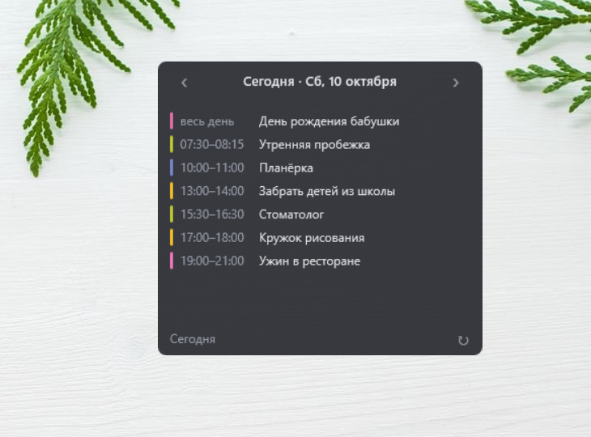
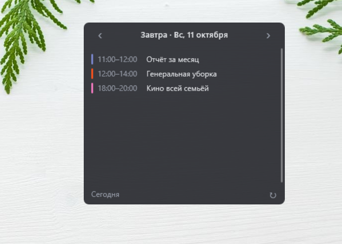

# Виджет календаря на рабочий стол
 

Виджет для Windows, который показывает события **Google Календаря на выбранный день**
с листанием по дням и цветами по категориям. Данные загружает Python-скрипт,
отображает [Rainmeter](https://www.rainmeter.net/), обновление — через Планировщик заданий Windows.

```
Google Календарь ──► Python ──► data.inc (22 дня) ──► Rainmeter
                       ▲                                 │
   Планировщик: каждые 4 ч с 00:05,           ‹ › листают дни из памяти,
   при входе в Windows; кнопка ↻              без обращения к API
```

## Возможности

- Несколько календарей (например, основной и семейный) в одном списке.
- День: время и название событий; сначала события «на весь день», потом по времени.
  События через полночь видны в оба дня (`23:00–…`, `…–07:00`).
- **‹ ›** — предыдущий/следующий день (диапазон: 7 дней назад и 14 вперёд), **«Сегодня»** — вернуться.
- **Клик по дате** — открыть этот день в Google Календаре под нужным аккаунтом.
- **Цветная полоска** у события — категория. Цвет выбирается так:
  цвет события в Google → ключевые слова в названии → цвет календаря.
- Прокрутка колёсиком на загруженных днях; до 15 событий в день, остальные — «+ ещё N».
- Кнопка ↻ — обновить сейчас. Нет интернета — до 3 попыток; при ошибке остаются последние данные.

## Как устроено листание

Python за один запуск загружает события сразу за **22 дня** и записывает их в `data.inc`
переменными `D0…D21` (сегодня — `TodayIndex`). Стрелки меняют только переменную `Index`,
а метры читают данные через вложенные переменные: `[#D[#Index]Title]`.
Поэтому переключение мгновенное и работает без интернета; свежесть данных — до следующего обновления.

## Структура проекта

| Файл | Назначение |
|---|---|
| `main.py` | точка входа: загрузка → обработка → запись → обновление скина, лог |
| `fetch.py` | загрузка событий (повторяющиеся разворачиваются Google) и палитры цветов |
| `transform.py` | часовые пояса, раскладка по дням, категории и цвета, переменные для скина |
| `export.py` | запись `data.inc` (UTF-16) и команда Rainmeter на обновление |
| `config.py` | пути, права (только чтение календаря), диапазон дней, лимит событий |
| `check_access.py` | проверка доступа к календарям — выводит только количества |
| `list_titles.py` | список уникальных названий событий в `data/titles.txt` — для подбора ключевых слов |
| `demo.py` | вымышленные данные для демо-режима |
| `settings.example.json` | шаблон настроек |
| `rainmeter/CalendarWidget/CalendarWidget.ini` | скин Rainmeter |

Не хранятся в git (см. `.gitignore`): `credentials.json`, `settings.json`, `data/`,
`rainmeter/CalendarWidget/@Resources/data.inc`, `logs/`, `.venv/`.

## Установка с нуля

### 1. Python-окружение
```
python -m venv .venv
.venv\Scripts\pip install -r requirements.txt
```

### 2. Доступ к календарям (сервисный аккаунт)
1. [Google Cloud Console](https://console.cloud.google.com) → проект (можно существующий).
2. APIs & Services → Library → включить **Google Calendar API** — в **проекте**, а не у аккаунта.
3. IAM & Admin → Service Accounts → отдельный аккаунт **без ролей**
   (отдельный от других виджетов — так ключи можно отзывать независимо).
4. Keys → Add key → JSON → сохранить в папку проекта как `credentials.json`.
5. В [Google Календаре](https://calendar.google.com) на компьютере: Настройки → календарь →
   «Открыть доступ отдельным пользователям» → email сервисного аккаунта →
   «Просмотр всех сведений о мероприятиях». Повторить для каждого календаря.

### 3. Настройки
Скопировать `settings.example.json` → `settings.json` и заполнить:

| Поле | Что указать |
|---|---|
| `google_account` | адрес аккаунта, под которым открывать календарь по клику (параметр `authuser`) |
| `calendars[].id` | ID календаря: у основного — адрес почты; у остальных — Настройки → «Интеграция календаря» → «Идентификатор календаря» |
| `calendars[].color` | цвет для событий без категории, `R,G,B` |
| `categories` | название, цвет `R,G,B`, ключевые слова (часть слова, без учёта регистра; при совпадении нескольких категорий побеждает верхняя) |

Проверка: `python check_access.py` — у каждого календаря ✓.
Подбор ключевых слов: `python list_titles.py` → открыть `data/titles.txt`.

### 4. Rainmeter
1. Ссылка на папку скина (PowerShell, путь — свой):
   ```
   New-Item -ItemType Junction -Path "$env:USERPROFILE\Documents\Rainmeter\Skins\CalendarWidget" -Target "<папка проекта>\rainmeter\CalendarWidget"
   ```
2. `python main.py --no-refresh` — появится `data.inc`.
3. Rainmeter → Manage → Refresh all → `CalendarWidget` → `CalendarWidget.ini` → Load.

### 5. Планировщик заданий
Создать задачу (Create Task, не Basic):
- **General:** Run only when user is logged on.
- **Triggers:**
  - Daily в 00:05, Advanced → Repeat task every **4 hours** (вписать вручную) for a duration of **1 day**;
  - At log on с задержкой 1 минута.
- **Actions:** Program `<папка проекта>\.venv\Scripts\pythonw.exe`, Arguments `main.py`,
  **Start in** `<папка проекта>`.
- **Conditions:** снять «Start the task only if the computer is on AC power».
- **Settings:** Run task as soon as possible after a scheduled start is missed;
  Stop the task if it runs longer than 1 hour; **не** отмечать «delete it after».

## Запуск вручную

```
python main.py               # обновить данные и виджет
python main.py --no-refresh  # только записать data.inc, не трогая Rainmeter
python main.py --demo        # вымышленные события — для скриншотов
```

### Демо-режим (для скриншотов)

`python main.py --demo` записывает в виджет вымышленные события (`demo.py`) и обновляет скин —
настоящие данные из Google при этом не загружаются. Сделайте скриншот, затем верните
свои данные: `python main.py` или кнопка ↻ на виджете (а также следующий запуск по расписанию).

## Настройка

- Диапазон дней и лимит событий — `DAYS_BACK`, `DAYS_FORWARD`, `MAX_EVENTS` в `config.py`.
  Если увеличить `MAX_EVENTS`, в скин нужно добавить строки `MeterTime/Text/BarN` по образцу.
- Внешний вид — секция `[Variables]` в `CalendarWidget.ini`: `W`, `ViewH`, `NavW`/`NavH`
  (зона клика стрелок), цвета. После правки: ПКМ по виджету → Refresh skin.
- Файл скина хранится в **UTF-16** (в git — в UTF-8 благодаря `.gitattributes`).

## Если что-то не работает

| Симптом | Причина / где смотреть |
|---|---|
| 403 `accessNotConfigured` | не включён Google Calendar API в проекте (после включения подождать 2–5 минут) |
| Календарь «не найден» (404) | неверный ID или календарь не открыт для email сервисного аккаунта |
| Данные не обновляются | `logs/widget.log`; в Планировщике Last Run Result — `0x0` |
| Кнопка срабатывает один раз | у метра нет `DynamicVariables=1` — без него `#Index#` в действии не обновляется |
| Клик по дате открывает не тот аккаунт | проверить `google_account` и что в браузере выполнен вход в этот аккаунт |
| Скин не загружается | Rainmeter → About → Log |

## Безопасность

- Сервисный аккаунт видит только календари, открытые ему явно, и только на чтение.
- `credentials.json` и `settings.json` (адрес почты, ID календарей, ключевые слова) — в `.gitignore`.
- В лог и в консоль выводятся только количества, без названий событий.
- При утечке ключа: Google Cloud → Service Accounts → Keys → удалить ключ и создать новый.
